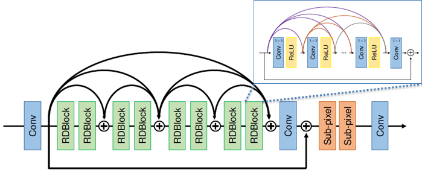

# NatSR

# [Natural and Realistic Single Image Super-Resolution with Explicit Natural Manifold Discrimination](http://openaccess.thecvf.com/content_CVPR_2019/html/Soh_Natural_and_Realistic_Single_Image_Super-Resolution_With_Explicit_Natural_Manifold_CVPR_2019_paper.html)

Jae Woong Soh, Gu Yong Park, Junho Jo, and Nam Ik Cho

[[Paper]](http://openaccess.thecvf.com/content_CVPR_2019/papers/Soh_Natural_and_Realistic_Single_Image_Super-Resolution_With_Explicit_Natural_Manifold_CVPR_2019_paper.pdf) [[Supplementary]](http://openaccess.thecvf.com/content_CVPR_2019/supplemental/Soh_Natural_and_Realistic_CVPR_2019_supplemental.pdf)

## Environments
- Ubuntu 16.04
- [Tensorflow 1.8](http://www.tensorflow.org/)
- CUDA 9.0 & cuDNN 7.1
- Python 3.6

## Abstract

Recently, many convolutional neural networks for single image super-resolution (SISR) have been proposed, which focus on reconstructing the high-resolution images in terms of objective distortion measures. However, the networks trained with objective loss functions generally fail to reconstruct the realistic fine textures and details that are essential for better perceptual quality. Recovering the realistic details remains a challenging problem, and only a few works have been proposed which aim at increasing the perceptual quality by generating enhanced textures. However, the generated fake details often make undesirable artifacts and the overall image looks somewhat unnatural. Therefore, in this paper, we present a new approach to reconstructing realistic super-resolved images with high perceptual quality, while maintaining the naturalness of the result. In particular, we focus on the domain prior properties of SISR problem. Specifically, we define the naturalness prior in the low-level domain and constrain the output image in the natural manifold, which eventually generates more natural and realistic images. Our results show better naturalness compared to the recent super-resolution algorithms including perception-oriented ones.
<br><br>

## Related Work

### Distortion Oriented Single Image Super-Resolution

#### [EDSR (CVPRW 2017)] Enhanced Deep Residual Networks for Single Image Super-Resolution <a href="http://openaccess.thecvf.com/content_cvpr_2017_workshops/w12/html/Lim_Enhanced_Deep_Residual_CVPR_2017_paper.html">Link</a> 

### Perception Oriented Single Image Super-Resolution

#### [SRGAN (CVPR 2017)] Photo-realistic Single Image Super-Resolution Using a Generative Adversarial Network <a href="http://openaccess.thecvf.com/content_cvpr_2017/html/Ledig_Photo-Realistic_Single_Image_CVPR_2017_paper.html">Link</a> 

#### [EnhanceNet (ICCV 2017)] Enhancenet: Single Image Super-Resolution Through Automated Texture Synthesis <a href="http://openaccess.thecvf.com/content_iccv_2017/html/Sajjadi_EnhanceNet_Single_Image_ICCV_2017_paper.html">Link</a>

#### [SFT-GAN (CVPR 2018)] Recovering Realistic Texture in Image Super-Resolution by Deep Spatial Feature Transform <a href="http://openaccess.thecvf.com/content_cvpr_2018/html/Wang_Recovering_Realistic_Texture_CVPR_2018_paper.html">Link</a>
<br><br>

## Brief Description of Our Proposed Method

### <u>Explicitly Modeling the SISR & Designing Natural Manifold</u>

<p align="center"></p>

As inifinite number of high-resolution (HR) images can be correspond to one low-resolution (LR) image, SISR is one-to-many problem.
Therefore, we first define HR space and we divided HR space into three subspaces based on our prior knowledge.

### <u>Natural Manifold Discrimination</u>

<p align="center"></p>

The network architecture of Natural Manifold Discriminator (NMD) and the loss function for training NMD.

### <u>Natural and Realistic Single Image Super-Resolution (NatSR)</u>

<p align="center">&nbsp;&nbsp;</p> 

Left: The overall training scheme & Right: The SR network (Generator) architecture.

## Experimental Results

**(FR-IQA) Results of the average PSNR (dB) and SSIM for the benchmark**

<p align="center"></p>

**(NR-IQA) Results of the [NIQE](https://ieeexplore.ieee.org/abstract/document/6353522/) and [NQSR](https://www.sciencedirect.com/science/article/pii/S107731421630203X) for BSD100 (Left)**
**Perception-Distortion Tradeoff [[Ref]](http://openaccess.thecvf.com/content_cvpr_2018/html/Blau_The_Perception-Distortion_Tradeoff_CVPR_2018_paper.html) Plot for BSD100 (Right)**

<p align="center"></p>
<p align="center"></p> 

** Download links for FRSR Results (We additionally trained the scaling factor x2 and x3 for FRSR which are not in the paper.)

[FRSR x2](https://drive.google.com/open?id=1os0iCOVTeLLzPTIh6F1h6_Rn_XFcPftO)<br>
[FRSR x3](https://drive.google.com/open?id=1CxzFYWTsE87-vOdngE_IKPPQqmYBEAMU)<br>
[FRSR x4](https://drive.google.com/open?id=1XrGfHhlw7lXzJJ41-HYj4Au9rFI7HXor)

## Visualized Results

<p align="center"></p>
<p align="center"></p>
<br><br>
<p align="center"></p>

## Brief explanation of contents

```
-- generate_Dataset: To generate training datasets (TFRecord)
-- Model: Pre-trained models are included.
    -> FRSR x2, FRSR x3, FRSR (x4), NatSR, NMD
-- Train_NMD: Training codes to Train NMD.

Rest of the files are for the training and the test of NatSR.
```

## Guidelines for Codes

**Requisites should be installed beforehand.**

Clone this repo.
```
git clone http://github.com/JWSoh/NatSR.git
cd NatSR/
```

### Generate TFRecord Dataset for Training

generate_NatSR.py for NatSR<br>
generate_TrainNMD.py for NMD

To train NMD, (MATLAB) bicubic interpolated LR images are required.

[Options]
```
cd generate_Dataset

python generate_NatSR.py --labelpath [HR Image Path] --datapath [LR Image Path] --tfrecord [TFRecord Path]
python generate_TrainNMD.py --labelpath [HR Image Path] --datapath [LR Image Path] --tfrecord [TFRecord Path]

```

### Train NMD

Codes related to training NMD are in the Train_NMD folder.<br>
You may change <b>config.py</b> file properly, such as the path to TFRecord file.

```
cd Train_NMD

python main.py --gpu [GPU_number] --trial [Trial of your training] --step [Global step]
```

### Train NatSR

You may also change <b>config.py</b> file adaptive to your environment.

Pre-trained NMD parameters are required.
Also, we found that fine-tuning from pre-trained FRSR shows much better results than training from scratch.

```
python main.py --gpu [GPU_number] --trial [Trial of your training] --step [Global step]
```

### Test

Ready for input data (low-resolution).

[Options]
```
python test.py --gpu [GPU_number] --ref [True/False] --datapath [LR path] --labelpath [HR path] --modelpath [pretrained model path] --model [NatSR/FRSR] --savepath [SR path] --save [True/False]

--gpu: If you have more than one gpu in your computer, the number designates the index of GPU which is going to be used. [Default 0]
--ref: [1/0] 1 if there exist reference images. (Reference images are just for PSNR measurements.) [Default 1]
--datapath: Path of input images.
--labelpath: Path of reference images. (Not required, only for PSNR.)
--modelpath: Path of pretrained models. (If you clone this repo., you don't need to specify.
--model: [NatSR/FRSR] The type of model. [Default: NatSR]
--savepath: Path for super-resolved images. [Default: result]
--save: [1/0] Flag whether to save SR images. [Default 1]

```

### Examples for test codes

To generate super-resolved image and also to measure PSNR.
```
python test.py --gpu 0 --datapath LR/Set5 --labelpath HR/Set5 --model NatSR
```
To generate output images, only.

```
python test.py --gpu 0 --ref 0 --datapath LR/Set5 --model NatSR
```

Super-resolve with FRSR (Distortion oriented model)

```
python test.py --gpu 0 --ref 0 --datapath LR/Set5 --model FRSR
```

### Important Codes for Training

The code below is how I injected DCT noise to the image.

```
def inject_dct(x, sigma):
    n, h, w, c = x.shape
    X_space = np.reshape(x, [n, h // 8, 8, w // 8, 8, c])
    X_dct_x = scipy.fftpack.dct(X_space, axis=2, norm='ortho')
    X_dct = scipy.fftpack.dct(X_dct_x, axis=4, norm='ortho')


    noise_raw= np.random.randn(n, h // 8, 8, w // 8, 8, c) * sigma
    z=np.zeros([n,h//8,8,w//8,8,c])
    z[:, :, 7, :, :, :] = noise_raw[:, :, 7, :, :, :]
    z[:, :, :, :, 7, :] = noise_raw[:, :, :, :, 7, :]

    X_dct_noise = X_dct + z

    Y_space_x = scipy.fftpack.idct(X_dct_noise, axis=2, norm='ortho')
    Y_space = scipy.fftpack.idct(Y_space_x, axis=4, norm='ortho')
    Y = np.reshape(Y_space, x.shape)

    return Y
```

## Citation
```
@InProceedings{Soh_2019_CVPR,
author = {Soh, Jae Woong and Park, Gu Yong and Jo, Junho and Cho, Nam Ik},
title = {Natural and Realistic Single Image Super-Resolution With Explicit Natural Manifold Discrimination},
booktitle = {The IEEE Conference on Computer Vision and Pattern Recognition (CVPR)},
month = {June},
year = {2019}
}
```

## Acknowledgement
Our Spectral Normalization implementations are based on the codes from [site](https://github.com/taki0112/Spectral_Normalization-Tensorflow).
